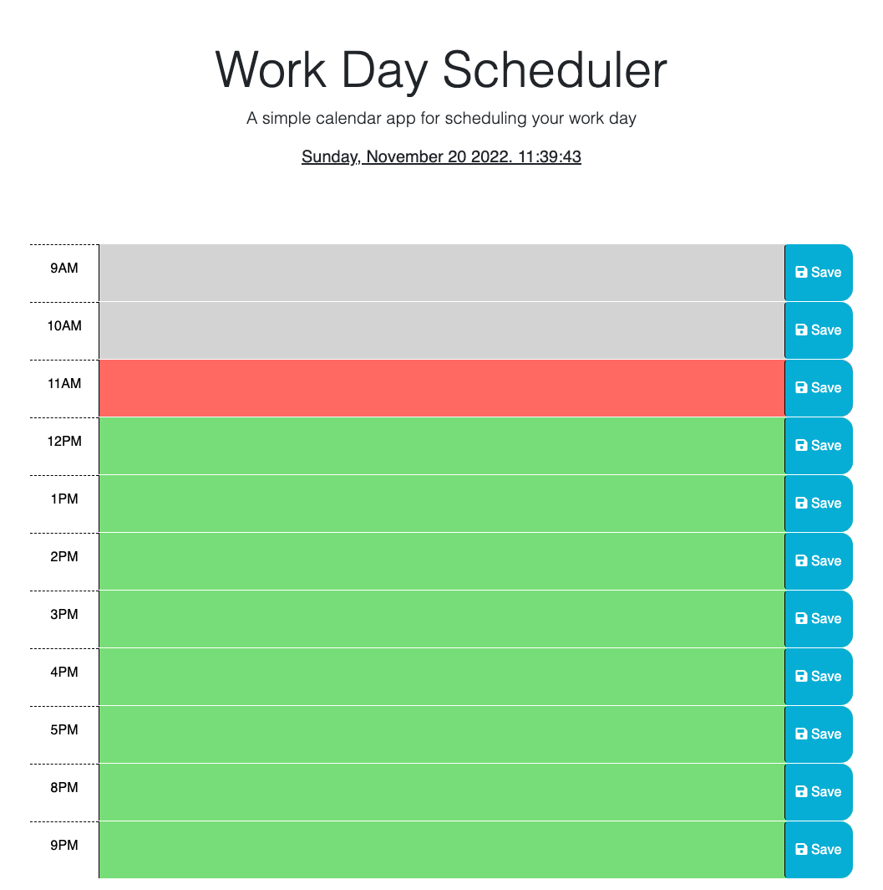

# 05-Workday-Scheduler

## Description

For this project I added functionality to a workday scheduler where users can input various tasks and save them to their local storage. The color of each timeblock changes based on the time of day. Past time blocks are listed in gray, present listed in red, and future are listed in green. This makes it easy for users to keep track of what time of day it is and provide a visual for tasks, their deadlines and what may need to have priority during their workday. 

## Links

[Github Repository](https://github.com/DelgaMatt/05-Workday-Scheduler)

## Installation

There is no installation required for this web application. By clicking on the link below, you will be directed to the usable webpage. 

[Deployed Webpage](https://delgamatt.github.io/05-Workday-Scheduler/)

## Usage

This web application takes a mobile first approach, though it is optimized for larger screens as well. The user is able to enter various tasks for their day onto it's constituent time block and is then able to save their task using the 'save' button to the right of each time block. Their information will be stored onto their system's local storage. When the user refreshes the page, the task will persist. 

## License

## Badges

